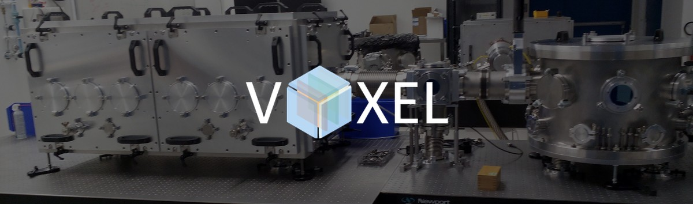

<div align="center">




**Voxel's Tango Control System device servers for experimental physics instrumentation**

[](https://www.ipfn.tecnico.ulisboa.pt/voxel)
[](https://www.tango-controls.org/)
[](https://pytango.readthedocs.io/)

</div>

Each repository is an independent Python device server (PyTango) that exposes a physical instrument to the Tango ecosystem, enabling remote control, logging, and integration with experiment automation.

> **New to Tango?** See [**HowTo**](https://github.com/Golp-Voxel/HowTo) for installation guides, device server setup steps, and experiment examples.

---

## 📷 Cameras

| Repository | Instrument | Library | Notes |
|:---|:---|:---:|:---|
| [Basler_AG_Camera](https://github.com/Golp-Voxel/Tango-Basler_AG_Camera) | Basler AG cameras | pypylon | Snap, continuous acquisition, ROI, auto-exposure/gain |
| [IDS_Camera](https://github.com/Golp-Voxel/Tango-IDS_Camera) | IDS cameras | ids_peak | Software trigger, USB 3 required |
| [GreatEyesCCD](https://github.com/Golp-Voxel/Tango-GreatEyesCCD) | GreatEyes CCD | greateyes.dll | Full-frame acquisition, Peltier temperature control |
| [Thorlabs_Cameras](https://github.com/Golp-Voxel/Tango-Thorlabs_Cameras) | Thorlabs scientific cameras | thorlabs_tsi_sdk | ROI, gain, exposure time, JSON commands |
| [MiniPIX_TPX3](https://github.com/Golp-Voxel/Tango-MiniPIX_TPX3) | MiniPIX TPX3 particle detector | PixetAPI / pypixet | Python 3.7 required |

## 🔩 Motion Controllers

| Repository | Instrument | Library | Notes |
|:---|:---|:---:|:---|
| [Standa_8SMC5-USB](https://github.com/Golp-Voxel/Tango-Standa_8SMC5-USB) | Standa 8SMC5-USB multi-axis controller | libximc | Multiple motors, virtual device support |
| [Newport_AG_UC8](https://github.com/Golp-Voxel/Tango-Newport_AG_UC8) | Newport AG-UC8 piezo controller | qcodes_contrib_drivers | 4 channels, step amplitude, position measurement |
| [Newport_SMC100](https://github.com/Golp-Voxel/Tango-Newport_SMC100) | Newport SMC100 single-axis controller | pyserial | Absolute/relative moves, home search, status codes |

## 🔬 Other Instruments

| Repository | Instrument | Library | Notes |
|:---|:---|:---:|:---|
| [Arduino_Shutter](https://github.com/Golp-Voxel/Tango-Arduino_Shutter) | Thorlabs shutter via Arduino | pyserial | JSON serial protocol, open/close cycles; PlatformIO firmware included |
| [DppMCA](https://github.com/Golp-Voxel/Tango-DppMCA) | Amptek DppMCA X-ray spectrometer | pyusb | Up to 8000-channel spectrum via USB |
| [Thorlabs_DMP40](https://github.com/Golp-Voxel/Tango-Thorlabs_DMP40) | Thorlabs DMP40 deformable mirror | ctypes (TLDFM_64.dll) | |
| [EdwardsController_6-Gauge](https://github.com/Golp-Voxel/Tango-EdwardsController_6-Gauge) | Edwards TIC vacuum gauge controller | pyserial | 6-gauge readout |
| [SLM](https://github.com/Golp-Voxel/Tango-SLM) | Spatial Light Modulator | — | |

## 🛠️ Utilities

| Repository | Description |
|:---|:---|
| [HowTo](https://github.com/Golp-Voxel/HowTo) | Tango installation guide, device server setup steps, and experiment examples |
| [ClientExemple](https://github.com/Golp-Voxel/Tango-ClientExemple) | Jupyter notebook client examples and MJPEG stream client |

---

## Getting Started

All device servers follow the same setup pattern:

```bash
git clone https://github.com/Golp-Voxel/<repo>.git
python -m venv tango-env
tango-env\Scripts\activate
pip install -r Requirements.txt
```

Copy `<DeviceName>.bat.temp` → `<DeviceName>.bat`, update the paths, then register the device in the Tango Database using **Jive/Astor**. See [HowTo](https://github.com/Golp-Voxel/HowTo) for the full step-by-step guide.
